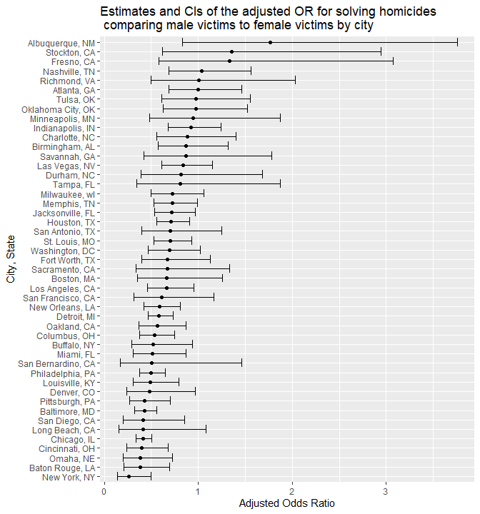
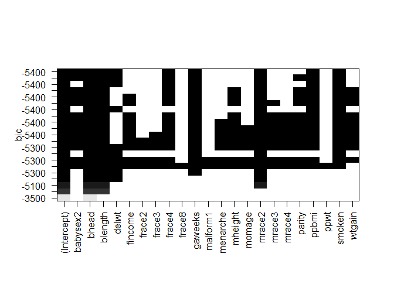

Homework 6
================
Hongjie Liu

Load necessary packages for homework 6.

``` r
library(tidyverse)
library(modelr)
```

## Problem 1

Load the dataset.

``` r
weather_df = 
  rnoaa::meteo_pull_monitors(
    c("USW00094728"),
    var = c("PRCP", "TMIN", "TMAX"), 
    date_min = "2017-01-01",
    date_max = "2017-12-31") %>%
  mutate(
    name = recode(id, USW00094728 = "CentralPark_NY"),
    tmin = tmin / 10,
    tmax = tmax / 10) %>%
  select(name, id, everything())
```

## Problem 2

Load the dataset. We create a `city_state` variable and a binary
variable indicating whether the homicide is solved. We omit cities
Dallas, TX; Phoenix, AZ; and Kansas City, MO – these don’t report victim
race. We also omit Tulsa, AL – this is a data entry mistake. We limit
our analysis those for whom `victim_race` is `white` or `black`.

``` r
homicide_df =
  read_csv("./data/homicide-data.csv") %>% 
  unite(city_state, city:state, sep = ", ") %>% 
  filter(
    !(city_state %in% c("Dallas, TX", "Phoenix, AZ", "Kansas City, MO", "Tulsa, AL")),
    victim_race %in% c("White", "Black")
  ) %>% 
  mutate(
    solved = ifelse(disposition %in% c("Closed without arrest", "Open/No arrest"), FALSE, TRUE),
    victim_age = as.numeric(victim_age),
    victim_sex = ifelse(victim_sex == "Unknown", NA, victim_sex),
    victim_sex = as.factor(victim_sex),
    victim_race = as.factor(victim_race)
  )
```

    ## Warning in mask$eval_all_mutate(quo): NAs introduced by coercion

For the city of Baltimore, MD, we use the `glm` function to fit a
logistic regression with resolved vs unresolved as the outcome and
victim age, sex and race as predictors. We save the output of `glm` as
an R object; apply the `broom::tidy` to this object; and obtain the
estimate and 95% confidence interval of the adjusted odds ratio for
solving homicides comparing male victims to female victims keeping all
other variables fixed.

``` r
baltimore_fit =
  homicide_df %>% 
  filter(city_state == "Baltimore, MD") %>% 
  glm(solved ~ victim_age + victim_sex + victim_race, data = ., family = binomial())

baltimore_fit %>% 
  broom::tidy() %>% 
  filter(term == "victim_sexMale") %>% 
  mutate(
    adjusted_OR_estimate = exp(estimate),
    adjusted_OR_lower = exp(estimate + qnorm(.025) * std.error),
    adjusted_OR_upper = exp(estimate + qnorm(.975) * std.error)
  ) %>% 
  select(adjusted_OR_estimate, adjusted_OR_lower, adjusted_OR_upper) %>% 
  knitr::kable(
    col.names = c("Estimate", "Lower bound of the 95% CI", "Upper bound of the 95% CI"),
    digits = 3
  )
```

| Estimate | Lower bound of the 95% CI | Upper bound of the 95% CI |
|---------:|--------------------------:|--------------------------:|
|    0.426 |                     0.325 |                     0.558 |

Now we run `glm` for each of the cities in our dataset, and extract the
adjusted odds ratio (and CI) for solving homicides comparing male
victims to female victims. We create a dataframe with estimated ORs and
CIs for each city.

``` r
adjusted_OR_df =
  homicide_df %>% 
  nest(df = -city_state) %>% 
  mutate(
    models = map(.x = df, ~glm(solved ~ victim_age + victim_sex + victim_race, data = .x, family = binomial())),
    results = map(models, broom::tidy)
  ) %>% 
  select(-df, -models) %>% 
  unnest(results) %>% 
  filter(term == "victim_sexMale") %>% 
  mutate(
    adjusted_OR_estimate = exp(estimate),
    adjusted_OR_lower = exp(estimate + qnorm(.025) * std.error),
    adjusted_OR_upper = exp(estimate + qnorm(.975) * std.error)
  ) %>% 
  select(city_state, adjusted_OR_estimate, adjusted_OR_lower, adjusted_OR_upper)

adjusted_OR_df
```

    ## # A tibble: 47 × 4
    ##    city_state      adjusted_OR_estimate adjusted_OR_lower adjusted_OR_upper
    ##    <chr>                          <dbl>             <dbl>             <dbl>
    ##  1 Albuquerque, NM                1.77              0.831             3.76 
    ##  2 Atlanta, GA                    1.00              0.684             1.46 
    ##  3 Baltimore, MD                  0.426             0.325             0.558
    ##  4 Baton Rouge, LA                0.381             0.209             0.695
    ##  5 Birmingham, AL                 0.870             0.574             1.32 
    ##  6 Boston, MA                     0.667             0.354             1.26 
    ##  7 Buffalo, NY                    0.521             0.290             0.935
    ##  8 Charlotte, NC                  0.884             0.557             1.40 
    ##  9 Chicago, IL                    0.410             0.336             0.501
    ## 10 Cincinnati, OH                 0.400             0.236             0.677
    ## # … with 37 more rows

We create a plot that shows the estimated ORs and CIs for each city.
Organize cities according to estimated OR.

``` r
adjusted_OR_df %>% 
  ggplot(aes(x = adjusted_OR_estimate, y = fct_reorder(city_state, adjusted_OR_estimate))) +
  geom_point() +
  geom_errorbar(aes(xmax = adjusted_OR_upper, xmin = adjusted_OR_lower)) +
  labs(
    title = "Estimates and CIs of the adjusted OR for solving homicides \n comparing male victims to female victims by city",
    x = "Adjusted Odds Ratio",
    y = "City, State"
  )
```

<!-- -->

Comment on the plot.

## Problem 3

Load and clean the data for regression analysis. There are no missing
data in the dataframe. We find that the values of `pnumlbw` and
`pnumsga` are all zeros, so we are not going to use these two variables
as predictors in our regression analysis.

``` r
birthweight_df =
  read_csv("./data/birthweight.csv") %>% 
  mutate(
    babysex = as.factor(babysex),
    frace = as.factor(frace),
    malform = as.factor(malform),
    mrace = as.factor(mrace)
  ) %>% 
  select(-pnumlbw, -pnumsga)
```

    ## Rows: 4342 Columns: 20
    ## ── Column specification ────────────────────────────────────────────────────────
    ## Delimiter: ","
    ## dbl (20): babysex, bhead, blength, bwt, delwt, fincome, frace, gaweeks, malf...
    ## 
    ## ℹ Use `spec()` to retrieve the full column specification for this data.
    ## ℹ Specify the column types or set `show_col_types = FALSE` to quiet this message.

We use criterion-based procedures. We examine all possible models and
choose the “best” using the Bayesian Information Criterion (BIC). We
choose the model with the smallest BIC value. The predictors of our
final model is `babysex`, `bhead`, `blength`, `delwt`, `frace`,
`gaweeks`, `mrace`, `ppbmi`, and `smoken`.

``` r
lm_allsub = leaps::regsubsets(bwt ~ ., data = birthweight_df, nvmax = 21)
```

    ## Warning in leaps.setup(x, y, wt = wt, nbest = nbest, nvmax = nvmax, force.in =
    ## force.in, : 1 linear dependencies found

``` r
plot(lm_allsub, scale = "bic")
```

<!-- -->

``` r
my_reg = lm(bwt ~ babysex + bhead + blength + delwt + frace + gaweeks + mrace + ppbmi + smoken, data = birthweight_df)
```
